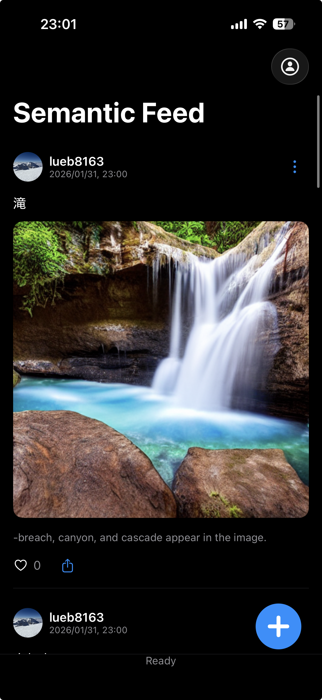

# Mim (iOS)

Mim is an experimental iOS social app that explores *semantic compression* of images.

Instead of sharing raw images, Mim treats images as **semantic representations**
and reconstructs them using on-device AI models.

This project is research-oriented and currently distributed via TestFlight.

---

## Features

- Post photos selected explicitly by the user
- Semantic embedding and prompt generation on-device
- Image reconstruction using Stable Diffusion (optional)
- Feed-based social UI
- Optional AI model download

---

## Status

- TestFlight External Beta
- Experimental / Research project
- Not intended for production use

---

## TestFlight

You can join the external beta here:

👉 [https://testflight.apple.com/join/9UndzF6P](https://testflight.apple.com/join/9UndzF6P)

---

## Privacy

- Photos are accessed **only via PhotosPicker**
- Only user-selected images are processed
- No background access to the photo library
- Image processing is primarily performed on-device
- No tracking SDKs are used

---

## Backend / Models

This repository contains **application source code only**.

- Production backend endpoints are **not included**
- Model download URLs are **placeholders**
- AI models are downloaded separately in the TestFlight build
- Model licenses are respected individually

---

## Requirements

- iOS 18+
- Devices with sufficient memory are recommended (iPhone 14+)

---

## License

Application source code is licensed under the Apache License 2.0.

AI models are subject to their respective licenses and are not included in this repository.
