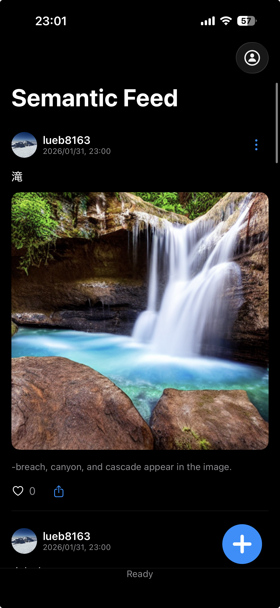

# Mim (iOS)

  
  

# Mim iOS App

Mim is an experimental iOS social app exploring **semantic communication** — sharing *meaning* instead of raw pixels.

Instead of distributing original image files in the feed, Mim extracts semantic information from user-selected images and reconstructs visuals through on-device AI workflows.

> Transmit meaning, not data.

---

## 🚀 Available on the App Store

  

External TestFlight beta (if available):  
https://testflight.apple.com/join/9UndzF6P

---

## 💻 Open Source Repository

The public version of the iOS client source code is available here:

👉 https://github.com/lube8163-lab/SemanticCompression-v2-public

This repository contains a cleaned and publish-ready version of the Mim iOS client.

- iOS app implementation
- Semantic extraction workflow
- Prompt generation pipeline
- Feed UI structure
- Model download management

AI models are **not bundled** and must be downloaded separately in-app.

---

## 🌱 Why Mim?

Modern social platforms transmit large binary data (images, videos, media files).

Mim experiments with a different idea:

- Extract semantic signals from an image  
- Transmit compact meaning representations  
- Reconstruct visuals locally on the receiving device  

This reduces raw data dependency and explores a privacy-preserving, meaning-first communication model.

---

## 🔬 What It Does

- Create social posts with text and/or images
- Extract semantic signals from selected images
- Generate prompts and reconstruct images using Stable Diffusion (when models are installed)
- Show low-resolution guide previews while generation is in progress
- Browse a timeline feed with likes and sharing

---

## 🛡 Safety & UGC Moderation

Mim is a UGC feed app and includes in-app safety controls:

- Email registration required before posting
- Privacy Policy and Terms agreement required on first launch
- In-app post reporting (`Timeline > Post menu > Report`)
- In-app user blocking (`Timeline > Post menu > Block User`)
- Blocked users’ posts are hidden from feed results
- Keyword-based screening before submission
- Reports are reviewed and actioned (content removal / account action) when necessary

---

## 🔒 Privacy

- Photos are accessed only through `PhotosPicker`
- Only user-selected images are processed
- No background photo library access
- Core semantic and image processing runs primarily on-device
- No tracking SDKs included

---

## 🤖 Models & Backend

- AI models are optional and downloaded separately in-app
- Model licenses are governed by their respective upstream terms
- Backend services are used for feed delivery, user accounts, and moderation workflows

---

## 📱 Requirements

- iOS 18+
- Recommended: newer devices with sufficient memory (e.g. iPhone 14 or later)

---

## 📊 Status

- ✅ App Store Release (v1.0)
- Ongoing experimental development
- Research-oriented project

---

## 📄 License

Application source code is licensed under the Apache License 2.0.

AI models are not bundled in this repository and remain under their own licenses.

---

## 📬 Contact

Developer contact: `lube8163@icloud.com`
